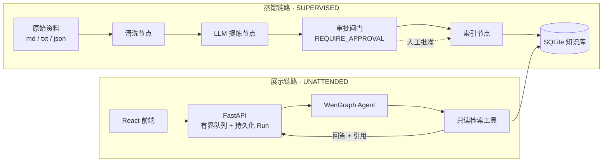

# Distill Agent

> 把任何人的资料自动蒸馏成知识库，跑一个只读检索的 AI 数字分身。一条图运行时、两张子图、同一套治理框架。

[](https://github.com/bq-wen/distill-agent/actions)


**Distill Agent** 是一个"资料 → 知识库 → AI 分身"的通用流水线模板：给任何人（你自己、候选人、专家）一份原始资料（访谈、聊天记录、简历、README），蒸馏链路自动提炼成可溯源的知识原子并写入本地知识库；访客与在线数字分身对话时，分身只在经过治理的只读检索边界内作答，回答自带引用卡片。

两条链路共用自研 [WenGraph](https://github.com/bq-wen/WenGraph) 图运行时与**同一套治理框架**（CapabilityPolicy / RiskPolicy / ToolGuard），只是参数不同：

| | 展示链路（在线分身） | 蒸馏链路（知识加工） |
|---|---|---|
| 执行模式 | `UNATTENDED` | `SUPERVISED` |
| 工具风险 | 只读检索（LOW）→ 自动放行 | 写审计产物（MEDIUM）/ 写知识库（HIGH）→ **强制人工审批** |
| 产物 | 带引用的回答 | 可溯源的知识原子 + 审计记录 |

## Highlights

- **双子图架构**：展示图与蒸馏图构建在同一 WenGraph 运行时之上；"同一套门卫、参数不同"——在线全自动、离线人工审批。
- **知识原子可溯源**：蒸馏产物携带 `content/kind/confidence/source_file`，错能查到源头、能被审批拦下、能回滚。
- **本地混合检索**：Sentence Transformers 语义检索 + SQLite FTS5 关键词检索，无需外部向量库。
- **安全引用合同**：引用卡片仅由审核过的公开元数据（`public_summary`/`public_url`）构成；原始 Markdown、本地路径、内部结构不出现在任何 API 字段。
- **数据驱动身份**：姓名、简介、覆盖主题、推荐问题全部来自你的身份文档（`profile: true`，见下方示例），前端纯渲染、零硬编码。
- **无登录、轻部署**：标签页会话（`sessionStorage`）+ 1 小时临时记忆；单进程、SQLite、Docker Compose 即可上线。

## Architecture



- **展示链路**：浏览器提交问题 → FastAPI 创建持久化 Run（`202` + 轮询）→ 固定数量 async Worker 消费有界队列 → Agent 先混合检索、再在 ToolGuard 只读边界内二次检索 → 回答带引用卡片。
- **蒸馏链路**：`SourceLoader → Cleaner → Extractor(LLM) → Structurer → ContentRouter → AuditGate → Indexer`；两个写闸门（审计产物 / 知识库）经同一 Guard 链强制人工审批，驳回或中断不会写入知识库。
- **单进程约束**：有界队列是进程内存结构，部署必须保持一个 Uvicorn worker；横向扩展需引入共享调度层（Redis/Celery）。

## Quick Start（三步上手）

> 需要 Python 3.12 与 Node.js 22+。

**第 1 步：clone 并初始化**

```bash
git clone --recurse-submodules https://github.com/bq-wen/distill-agent.git
cd distill-agent
python3.12 -m venv .venv
.venv/bin/pip install -r requirements-dev.txt
cd frontend && npm install && cd ..
cp .env.example .env   # 填 OPENAI_API_KEY / OPENAI_BASE_URL / OPENAI_MODEL
```

**第 2 步：蒸馏示例资料（可选，看完整演示用）**

仓库自带虚构示例人物 `Lin`（`knowledge/examples/`）。跑一遍蒸馏链路，观察审批闸门如何拦截写库（示例数据写入独立库 `data/example.db`，不碰真实库）：

```bash
# 交互式：两个写闸门处会暂停，输入 y 批准
.venv/bin/python -m personal_agent.distillation.cli run \
  --input knowledge/examples/raw --database data/example.db

# 演示后查看审计产物，再索引 Lin 的示例库
ls data/distill/audit/          # 每轮 run 的完整审计
.venv/bin/python -m personal_agent.knowledge.cli knowledge knowledge/examples \
  --database data/example.db
```

**第 3 步：构建前端并启动**

```bash
cd frontend && npm run build && cd ..
set -a && source .env && set +a
# 用示例库启动就是 Lin 的分身；去掉 PERSONAL_AGENT_KNOWLEDGE_DB 则用真实库
PERSONAL_AGENT_KNOWLEDGE_DB=data/example.db .venv/bin/python -m uvicorn \
  personal_agent.api.bootstrap:create_production_app --factory --host 0.0.0.0 --port 8000
```

打开 `http://localhost:8000`，向"Lin"的数字分身提问；没有资料的问题会明确说明资料未覆盖、不编造。开发模式用 `cd frontend && npm run dev`（Vite 代理 `/api`），页面地址 `http://localhost:5173`。

## 换成你自己的资料

> 真实使用前：删除或移走 `knowledge/examples/`（否则它的内容会被索引进你的知识库）。

1. 创建 `knowledge/profile.md` 作为身份文档（front matter 带 `profile: true` 与 `name`，示例见 [examples/profile.md](knowledge/examples/profile.md)）。
2. 在 `knowledge/` 下写你的项目资料 Markdown（YAML front matter 见 [知识文档格式](#知识文档格式)）。
3. 把访谈/聊天记录等原始材料放任意目录，跑蒸馏链路（见上）；或直接运行 `python -m personal_agent.knowledge.cli knowledge --database data/knowledge.db` 建索引。
4. 重新构建前端并启动，就是你的数字分身。

### 知识文档格式

```markdown
---
source_id: wengraph-overview     # 稳定、仅小写字母/数字/-/_
project: WenGraph
title: WenGraph 架构说明
visibility: private              # 或 public
public_summary: 自研 Agent 图运行时，关注可控执行与工具治理。  # 页面引用卡片
public_url: https://github.com/bq-wen/wengraph                 # 可选
public_questions:                # 可选：出现在页面推荐问题区
  - WenGraph 解决了什么问题？
topics: [architecture]           # 可选：主题标签
---
# 正文（私有内容仅供 Agent 检索，不出现在任何 API 字段）
```

`source_id` 必须稳定且只包含小写字母、数字、`-` 或 `_`。生产索引使用本地 Sentence Transformers；`--hash-embedding` 仅供无模型下载的测试，不适用于生产检索。

## Retrieval Evaluation（检索评估）

量化混合检索能力（recall@k / precision@k / MRR），评估与在线服务走同一条 `search_hybrid` 路径：

```bash
python3.12 -m personal_agent.knowledge.eval \
  --database data/knowledge.db --cases eval_cases/example.yaml \
  --strategy all --min-score 0.35 --report data/eval-report.json
```

`eval_cases/example.yaml` 是评估集格式（问题 → 期望命中的 `source_id`），扩充真实资料后同步扩展并重跑。

## Distillation Pipeline（蒸馏链路）

后台知识处理流水线：把**原始资料目录**自动加工成知识库。同一条 WenGraph 图运行时，蒸馏图运行在 `SUPERVISED` 模式——写审计产物（MEDIUM 风险）与写知识库（HIGH 风险）两个工具在 ToolGuard 处强制 `REQUIRE_APPROVAL`，未批准的内容不会进入知识库。

```bash
# 交互式运行（写闸门处暂停等批准）
.venv/bin/python -m personal_agent.distillation.cli run --input <目录> --database data/knowledge.db

# 全自动（演示/CI）：直接批准所有闸门
.venv/bin/python -m personal_agent.distillation.cli run --input <目录> --database data/knowledge.db --yes

# 非 TTY 环境：run 停在第一个审批闸门并打印 run_id，随后可单独批准/驳回。
# approve 每次只批准一个闸门（写审计 → 再 approve → 写库），重复执行直到 completed
python3.12 -m personal_agent.distillation.cli approve --run distill-xxxx --database data/knowledge.db
python3.12 -m personal_agent.distillation.cli approve --run distill-xxxx --database data/knowledge.db --reject
```

流水线：`SourceLoader → Cleaner → Extractor(LLM) → Structurer → AuditGate → Indexer`。输入支持 `.md/.txt/.json`；LLM 提炼产物为可溯源的知识原子（`content/kind/confidence/source_file`）；审核产物落在 `data/distill/audit/<run_id>.json`，增量哈希记录在 `data/distill/state.json`（每个文件记录 `content_hash` 与它生成的 `source_id`，兼容旧版纯哈希 state 自动迁移）。生产检索仍用本地 Sentence Transformers，`--hash-embedding` 仅供测试。

增量模式（`--incremental`）额外处理删除与改名：已删除的输入文件、以及改名后旧 `source_id` 对应的知识来源，会通过受审批保护的 `index_documents` 工具一并清理，保证知识库与资料目录一致。蒸馏产物的 `source_id` 是**不透明哈希**（`distilled-<sha256>`），title/summary 不暴露原始文件路径。

## Profile 身份文档

`knowledge/profile.md` 是数字分身的身份来源（front matter 带 `profile: true`，`source_id` 固定为 `profile`）。姓名、monogram、简介、GitHub、覆盖主题与推荐问题全部由此驱动；未载入时回落中性默认身份，页面不写死任何个人内容。

## Docker Deployment

```bash
cp .env.example .env   # 填 OPENAI_API_KEY / OPENAI_BASE_URL / OPENAI_MODEL
docker compose build
docker compose run --rm distill-agent \
  python -m personal_agent.knowledge.cli /app/knowledge --database /app/data/knowledge.db
docker compose up -d
```

访问 `http://localhost:8000`。`./data` 持久化 SQLite，`./knowledge` 只读挂载资料源，模型缓存存 Docker volume。

> **国内服务器注意**：首次启动需下载 embedding 模型（默认 `BAAI/bge-small-zh-v1.5`）。请在 `.env` 设置 `HF_ENDPOINT=https://hf-mirror.com`（已在 `.env.example` 注释）；生产镜像建议构建时预下载模型（`HF_HUB_OFFLINE=1` + 构建阶段 RUN）。

生产上线（域名 + HTTPS + Nginx 反代）的配置模板见 `deploy/`（Nginx 反代、Let's Encrypt、systemd/compose 说明），并注意 Security Notes 中的单 worker 约束。

## 配置项

| 环境变量 | 默认值 | 说明 |
|---|---|---|
| `OPENAI_BASE_URL` / `OPENAI_API_KEY` / `OPENAI_MODEL` | - | OpenAI-compatible 聊天模型 |
| `OPENAI_TIMEOUT` | `120` | LLM 请求超时（秒，推理模型可能较慢） |
| `PERSONAL_AGENT_EMBEDDING_MODEL` | `BAAI/bge-small-zh-v1.5` | 语义检索模型 |
| `PERSONAL_AGENT_EMBEDDING_DEVICE` | `cpu` | 模型设备 |
| `PERSONAL_AGENT_DATA_DIR` | `data` | SQLite 与蒸馏产物目录 |
| `PERSONAL_AGENT_QUEUE_WORKERS` / `QUEUE_SIZE` | `2` / `10` | 异步 Worker 与队列容量（并发 ~10 人） |
| `PERSONAL_AGENT_CONVERSATION_TTL_HOURS` | `0.5` | 临时会话保留时长（30 分钟，防记忆滥用） |
| `PERSONAL_AGENT_MAX_ACTIVE_CONVERSATIONS` | `15` | 活跃会话数上限（日活 <50 设计），超出按 LRU 驱逐最久未活动会话 |
| `PERSONAL_AGENT_MAX_EVENTS_PER_CONVERSATION` | `25` | 单会话事件数上限（约 12 轮），超出淘汰最旧 |
| `PERSONAL_AGENT_MINIMUM_SEMANTIC_SCORE` | `0.35` | 语义检索阈值 |
| `PERSONAL_AGENT_RATE_LIMIT_PER_MINUTE` | `10` | 每客户端提交限流（日活 <50 够用） |
| `PERSONAL_AGENT_DAILY_TOKEN_BUDGET` | `300000` | 展示链路每日 LLM token 预算（≈110 次问答/天；超限后新提交返回 429） |
| `HF_ENDPOINT` / `HF_HUB_OFFLINE` | - | 模型下载镜像/离线（国内网络） |

## Project Structure

```
├── personal_agent/            # Python 应用
│   ├── api/                   # FastAPI：bootstrap/app/runs/rate_limit
│   ├── application/           # 展示链路：WenGraph 图、检索工具、profile 服务
│   ├── knowledge/             # 知识层：文档解析、SQLite 存储、混合检索
│   ├── distillation/          # 蒸馏链路：节点、审批图、CLI、SQLite 跨进程恢复
│   ├── contracts.py           # API 共享 Pydantic 契约
│   └── wengraph_runtime.py    # 唯一 vendor 导入边界
├── frontend/                  # React + Vite 前端（数据驱动渲染）
├── knowledge/                 # 知识资料源（可版本控制）
│   ├── examples/profile.md    # 示例身份文档（虚构人物 Lin，clone 即演示）
│   └── placeholder-project.md # 占位项目资料
├── vendor/wengraph/           # 固定版本图运行时子模块
├── deploy/                    # Nginx / HTTPS 部署模板
├── tests/                     # pytest（64+，含蒸馏审批跨进程恢复）
├── Dockerfile / compose.yaml  # 容器化
└── .github/workflows/ci.yml   # CI：ruff + pytest + 前端 lint/build
```

## Roadmap

- [x] 数据驱动身份与主题（profile/topics API）
- [x] 蒸馏链路 v1（SUPERVISED 审批 + 审计 + 增量）
- [x] 容器化与 CI
- [x] 检索评估集（recall@k / precision@k / MRR）
- [ ] 流式输出（SSE）替代轮询
- [ ] 蒸馏管理界面（原子级审批、差异对比）
- [ ] 微信/语雀等聊天导出解析器（蒸馏输入 v2）
- [ ] 共享调度层（Redis 队列）支持多实例

## FAQ

**Q: 与"个人 RAG 助手"有什么区别？**
A: 重点是治理叙事：不是"能聊就行"，而是知识从"原始资料"到"可回答"的每一步都有契约、审计和人工闸门；展示链路对访客只暴露审核过的公开元数据。

**Q: 蒸馏的 PII 和准确性怎么保证？**
A: 提炼是提示词级约束 + **强制人工审批**（写库前必须批准，产物可回滚）；审计产物保留每个原子的来源文件，错误可溯源到原始段落。

**Q: 前端没有测试？**
A: 前端目前依赖 lint + 类型检查 + 构建；核心逻辑在后端（64+ pytest 覆盖，含审批暂停、驳回不写库、跨进程恢复）。

**Q: vendor/wengraph 子模块拉不下来？**
A: 子模块 URL 使用 HTTPS（`https://github.com/bq-wen/WenGraph.git`），WenGraph 是公开仓库，`git clone --recurse-submodules` 即可；固定 commit，应用层只通过 `personal_agent/wengraph_runtime.py` 导入。

## Security Notes

- `.env` 被 Git 忽略；若 Key 曾泄漏到聊天记录/日志，请立即轮换。
- 公开引用只使用 front matter 审核过的 `public_summary`/`public_url`；**回答正文是提示词级软约束**——模型组织回答时会看到检索到的私有正文，理论上可能复述。公网部署前建议出站脱敏/摘要审核，或配合限流与内网访问。
- 单进程限流（内存固定窗口）；横向扩展需换共享限流器与共享调度层。

## Verification

```bash
.venv/bin/ruff check .                  # lint（ruff.toml 配置）
.venv/bin/ruff format --check .         # 格式
.venv/bin/mypy personal_agent           # 类型检查
.venv/bin/python -m pytest -q           # 64+ tests
cd frontend && npm run lint && npm run build   # 前端
```

CI（`.github/workflows/ci.yml`）：push 到 `main` 或 PR 时自动跑 后端 ruff + format + mypy + pytest 与 前端 eslint + build + Docker 镜像构建。

## License

[MIT](LICENSE) — 自由使用、修改、商用，保留版权声明即可。
